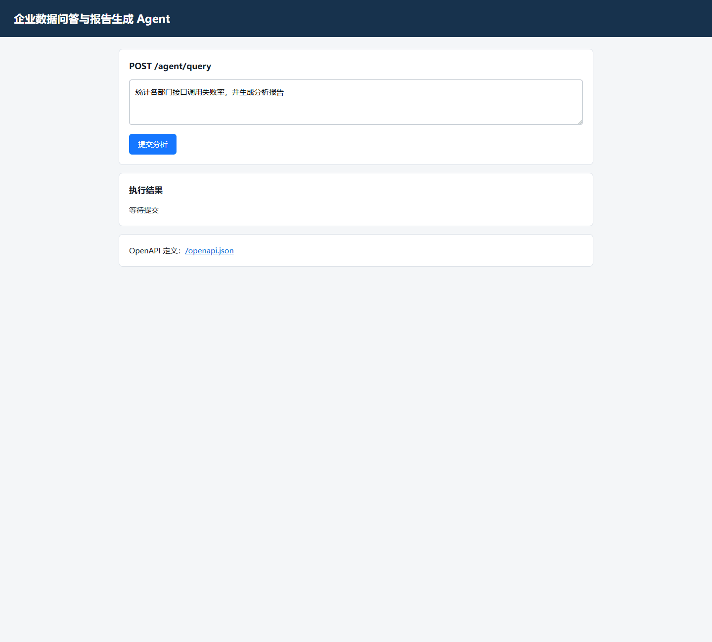
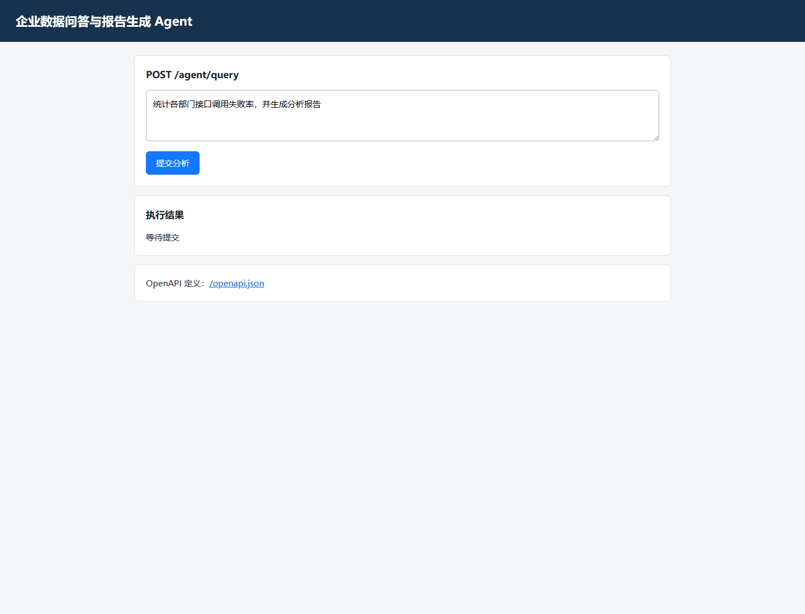
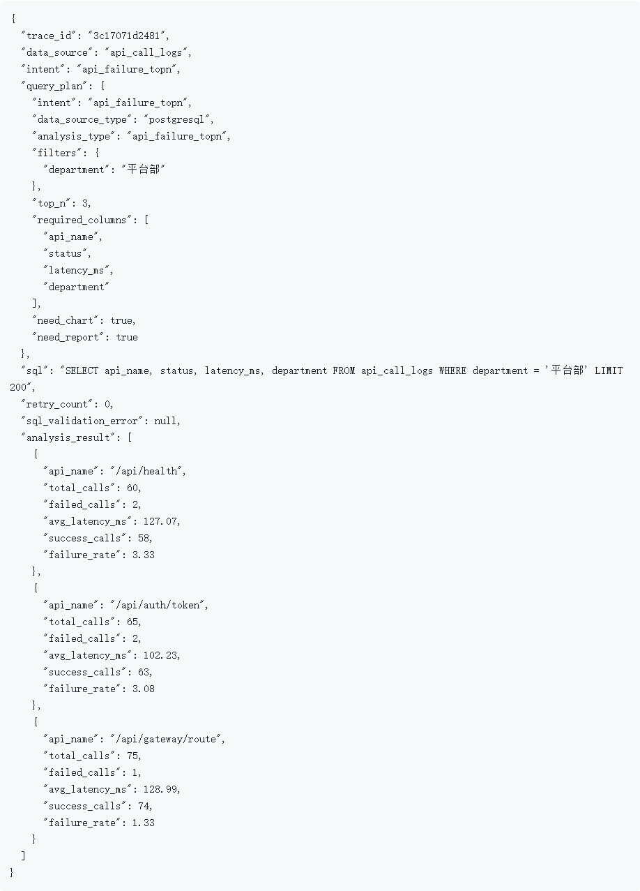
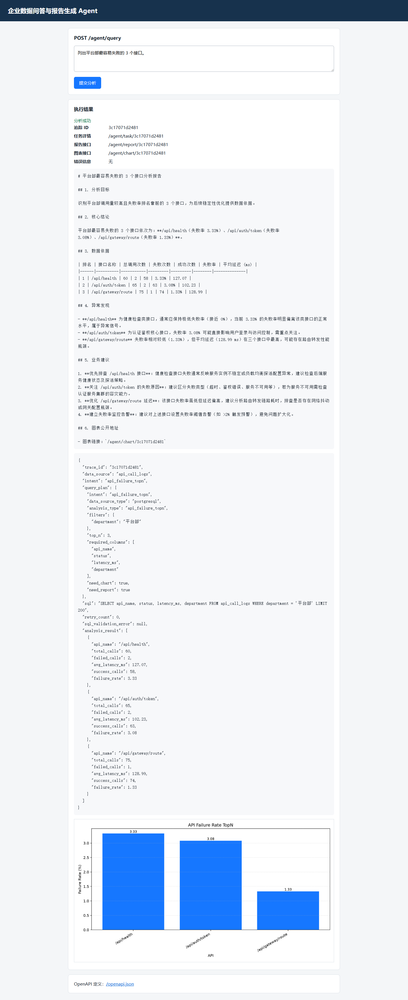
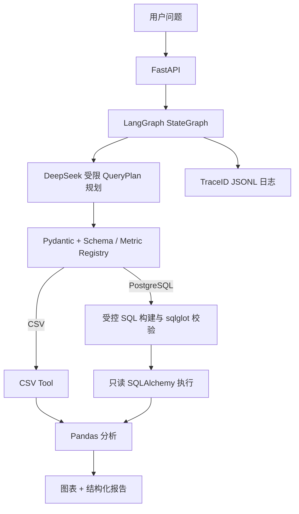
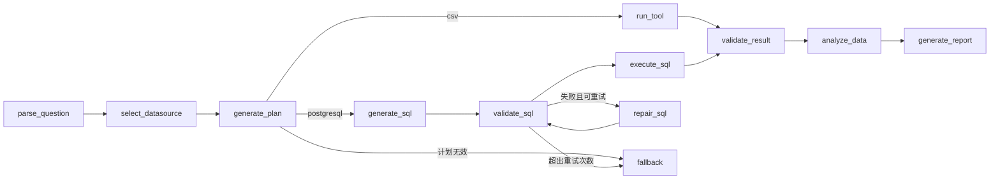

# 企业数据问答与报告生成 Agent

[](https://github.com/xueren12/enterprise-data-agent/actions/workflows/ci.yml)

面向企业接口调用日志的可运行数据分析 Agent。用户输入自然语言问题后，系统由 DeepSeek 在受控目录范围内规划 `QueryPlan`，经 Pydantic、Schema Registry 和 Metric Registry 校验后，进入 CSV 或 PostgreSQL 分支，再由 Pandas 输出统计表、图表和结构化报告。

仓库主页：[github.com/xueren12/enterprise-data-agent](https://github.com/xueren12/enterprise-data-agent)



## 真实运行素材

| Web Demo | 接口执行明细 |
| --- | --- |
|  |  |



## 核心亮点

- 模型负责在白名单内规划意图、指标、筛选条件和 TopN；模型不可用或输出不合法时，才走确定性规则兜底。
- `QueryPlan` 不是自由文本：数据表、字段、筛选条件、指标口径和图表/报告开关均由 Registry 校验。
- PostgreSQL 分支不直接执行模型 SQL：sqlglot 检查单条 SELECT、表/字段白名单、敏感字段、LIMIT、注释、多语句和高风险函数；数据库账号和事务也都只读。
- 使用固定随机种子生成 36,450 条脱敏合成日志，覆盖 180 天，并植入可观察的失败率和延迟异常。
- 提供真实 DeepSeek + 人工金标 QueryPlan 评测，且将其与规则/安全回归集明确分开。

已提交的 DeepSeek 运行基线：24 条人工金标中，QueryPlan 校验/规范化通过 24 条，语义完全一致 18 条（75.00%）；这 18 条的受控 SQL 均在 PostgreSQL 只读执行成功。详情见 [评测报告](docs/evaluation_report.md)。

## 架构


```mermaid
flowchart TD
    U["用户问题"] --> API["FastAPI"]
    API --> G["LangGraph StateGraph"]
    G --> L["DeepSeek 受限 QueryPlan 规划"]
    L --> R["Pydantic + Schema / Metric Registry"]
    R -->|"CSV"| C["CSV Tool"]
    R -->|"PostgreSQL"| S["受控 SQL 构建与 sqlglot 校验"]
    S --> D["只读 SQLAlchemy 执行"]
    C --> P["Pandas 分析"]
    D --> P
    P --> O["图表 + 结构化报告"]
    G --> T["TraceID JSONL 日志"]
```


```mermaid
flowchart LR
    A["parse_question"] --> B["select_datasource"] --> C["generate_plan"]
    C -->|"csv"| D["run_tool"]
    C -->|"postgresql"| E["generate_sql"] --> F["validate_sql"] --> G["execute_sql"]
    F -->|"失败且可重试"| H["repair_sql"] --> F
    D --> I["validate_result"]
    G --> I --> J["analyze_data"] --> K["generate_report"]
    C -->|"计划无效"| Z["fallback"]
    F -->|"超出重试次数"| Z
```

## 快速启动

### Docker

```powershell
git clone https://github.com/xueren12/enterprise-data-agent.git
cd enterprise-data-agent
docker compose up -d --build
```

访问 [http://localhost:8000/docs](http://localhost:8000/docs)。Docker 默认使用 PostgreSQL 和最小权限 `agent_reader` 账号；不配置 API Key 时仍可用规则兜底完成演示。

### 本地 Python

```powershell
git clone https://github.com/xueren12/enterprise-data-agent.git
cd enterprise-data-agent
py -3.11 -m venv .venv
.\.venv\Scripts\Activate.ps1
python -m pip install -r requirements-dev.txt
python run_demo.py
python -m uvicorn app.main:app --reload
```

## 环境变量

复制 `.env.example` 为 `.env` 后按需填写：

| 变量 | 含义 | 默认值 |
| --- | --- | --- |
| `DEEPSEEK_API_KEY` | DeepSeek 密钥；留空时启用规则兜底 | 空 |
| `DEEPSEEK_BASE_URL` | DeepSeek 接口地址 | `https://api.deepseek.com` |
| `DEEPSEEK_MODEL` | 模型名称 | `deepseek-chat` |
| `DATABASE_URL` | PostgreSQL 只读连接串 | 本地可选 |
| `DEFAULT_DATA_SOURCE` | `auto` / `csv` / `postgresql` | `auto` |
| `SQL_MAX_LIMIT` | 允许查询的最大行数 | `200` |
| `SQL_MAX_RETRIES` | SQL 修复最大次数 | `2` |
| `COMPOSE_DATABASE_URL` | Docker 容器内 PostgreSQL 连接串 | `postgres:5432` 服务地址 |
| `COMPOSE_DEFAULT_DATA_SOURCE` | Docker 容器默认数据源 | `postgresql` |

## 示例问题

- 统计各部门接口调用失败率，并生成分析报告
- 列出平台部最容易失败的 3 个接口
- 分析最近 30 天运维部响应时间最高的接口
- 画出最近 7 天各接口失败率的每日走势
- 分析最近一周各部门调用量的变化趋势

## 接口

| 方法 | 路径 | 说明 |
| --- | --- | --- |
| `GET` | `/docs` | 可交互 Web Demo |
| `GET` | `/health` | 健康检查 |
| `POST` | `/agent/query` | 提交自然语言问题 |
| `GET` | `/agent/task/{task_id}` | 查询任务详情 |
| `GET` | `/agent/report/{task_id}` | 获取报告 |
| `GET` | `/agent/chart/{task_id}` | 获取图表文件 |

`POST /agent/query` 的公开响应仅返回图表 URL，不暴露服务端绝对文件路径：

```json
{
  "trace_id": "a1b2c3d4e5f6",
  "status": "success",
  "report": "## 分析目标\n...",
  "chart_url": "/agent/chart/a1b2c3d4e5f6",
  "task_url": "/agent/task/a1b2c3d4e5f6",
  "error": null
}
```

## 数据与评测

`scripts/generate_synthetic_logs.py` 以固定随机种子生成 `data/sample_api_logs.csv`；执行后能得到相同的 36,450 条脱敏日志。Docker PostgreSQL 使用 `COPY` 加载同一份 CSV，保证 CSV 和数据库分支使用相同数据。

```powershell
# 确定性规则、SQL 安全与异常兜底回归，不代表 LLM 指标
python evaluation/run_evaluation.py --mode rule

# 真实调用 DeepSeek，和 24 条人工标注 QueryPlan 金标逐条比较
python evaluation/run_evaluation.py --mode llm

# 测试
python -m pytest -q
```

评测口径、结果字段和不可作出的结论见 [docs/evaluation_report.md](docs/evaluation_report.md)。

## 项目结构

```text
app/                 FastAPI、LangGraph 节点、Registry、工具和安全服务
data/                合成日志与 PostgreSQL 初始化脚本
evaluation/          规则回归集、人工金标集和评测脚本
scripts/             可复现数据生成与演示素材脚本
tests/               单元与 PostgreSQL 集成测试
```

## 后续方向

- 加入鉴权、行级权限、限流和审计存储。
- 将文件任务状态迁移到数据库或任务队列。
- 扩展多表语义层、指标血缘和数据质量规则。
- 固定模型版本后扩充人工金标集，并持续记录 LLM 评测趋势。

## License

[MIT](LICENSE)
